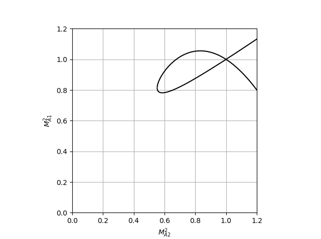

Rankine-Hugoniot relation solver for anisotropic plasmas.

<!-- @import "[TOC]" {cmd="toc" depthFrom=2 depthTo=6 orderedList=false} -->

<!-- code_chunk_output -->

- [Install/uninstall](#installuninstall)
- [Usage](#usage)
- [Theoretical description](#theoretical-description)

<!-- /code_chunk_output -->


## Install/uninstall

+ install

    ```shell
    pip install rhsolpy==1.0.0a0
    ```

+ uninstall

    ```shell
    pip uninstall rhsolpy==1.0.0a0
    ```

## Usage

```python
import rhsolpy.rankine_hugoniot as rh
obj = rh.AnisotropicMHD()

obj.set_param(beta1=1e-2, eps1=1.0, eps2=0.6)
obj.solve()

obj.plot()
```



## Theoretical description

